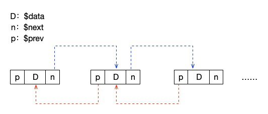
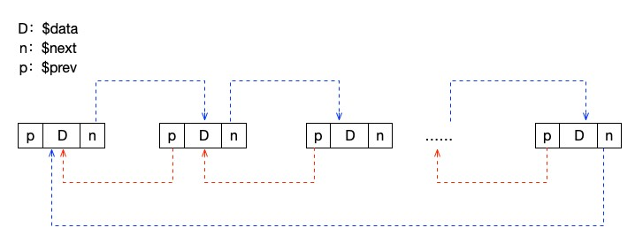

# 2.4 链表的其它形式

在上篇文章中，我们已经说过了链表除了简单的那一种单向链表外，还有其它的几种形式。当然，这也是链表这种结构的一大特点，非常地灵活和方便，我们简单的想一想。如果让最后一个节点的 $next 指回第一个节点，那么这就样就形成了一个环，这就是一个循环链表了。如果我们在每个节点上增加一个指向上一个节点的 $prev 属性，那么这个链表就变成了一个双向链表了。如果我们在双向链表的基础上也让最后一个节点的 $next 指向第一个节点，同时让第一个节点的 $prev 指向最后一个节点，这不就是一个双向循环链表了嘛。下面我们就来具体的看一看。

## 循环链表

就像上文所说的，我们让最后一个节点指向第一个节点，这样形成的链表就是一个循环链表，如下图所示：


关于循环的链表的操作我们不做详细的说明，其实大部分代码和单向链表是一样的，只是需要注意两个地方：

1.初始化、插入操作的时候，注意最后一个节点的指向，最后一个节点的 $next 要指向第一个节点
2.判断链表遍历是否完成的条件为 $item->next == $head ，也就是说，判断这个节点的下一个节点如果是头节点的话，链表就遍历完成了。

## 双向链表

双向链表则是在 LinkedList 这个类里面增加一个属性来指向上一个节点。

```php
// 双向链表
class LinkedList
{
    public $data;

    public $prev;
    public $next;
}
```



接下来，我们初始化一个双向链表。

```php
/**
 * 生成链表
 */
function createLinkedList()
{
    $list = new LinkedList();
    $list->data = null;
    $list->next = null;
    $list->prev = null; // ** 全部都初始化为 null **
    return $list;
}

/**
 * 初始化链表
 * @param array $data 链表中要保存的数据，这里以数组为参考
 * @return LinkedList 链表数据
 */
function Init(array $data)
{
    // 初始化
    $list = createLinkedList();
    $r = $list;
    foreach ($data as $key => $value) {
        $link = new LinkedList();
        $link->data = $value;
        $link->next = null;
        $r->next = $link;
        $link->prev = $r; // ** 增加上级指向 **
        $r = $link;
    }
    return $list;
}

$link = Init(range(1, 10));

var_dump($link);
var_dump($link->next->next->next->next);
// object(LinkedList)#5 (3) {
//     ["data"]=>
//     int(4)
//     ["prev"]=>
//     object(LinkedList)#4 (3) {
//       ["data"]=>
//       int(3)
//       ["prev"]=>
//       object(LinkedList)#3 (3) {
//         ["data"]=>
//         int(2)
//         ["prev"]=>
//         object(LinkedList)#2 (3) {
//           ["data"]=>
//           int(1)
//           ["prev"]=>
//           object(LinkedList)#1 (3) {
//             ["data"]=>
//             NULL
//             ["prev"]=>
//             NULL
//             ["next"]=>
//             *RECURSION*
//           }
//           ["next"]=>
//           *RECURSION*
//         }
//         ["next"]=>
//         *RECURSION*
//       }
//       ["next"]=>
//       *RECURSION*
//     }
//     ["next"]=>
//     object(LinkedList)#6 (3) {
//       ["data"]=>
//       int(5)
//       ["prev"]=>
//       *RECURSION*
//       ["next"]=>
//       object(LinkedList)#7 (3) {
//         ["data"]=>
//         int(6)
//         ["prev"]=>
//         *RECURSION*
//         ["next"]=>
//         object(LinkedList)#8 (3) {
//           ["data"]=>
//           int(7)
//           ["prev"]=>
//           *RECURSION*
//           ["next"]=>
//           object(LinkedList)#9 (3) {
//             ["data"]=>
//             int(8)
//             ["prev"]=>
//             *RECURSION*
//             ["next"]=>
//             object(LinkedList)#10 (3) {
//               ["data"]=>
//               int(9)
//               ["prev"]=>
//               *RECURSION*
//               ["next"]=>
//               object(LinkedList)#11 (3) {
//                 ["data"]=>
//                 int(10)
//                 ["prev"]=>
//                 *RECURSION*
//                 ["next"]=>
//                 NULL
//               }
//             }
//           }
//         }
//       }
//     }
//   }

echo $link->next->next->next->next->data, PHP_EOL; // 4
echo $link->next->next->next->next->prev->data, PHP_EOL; // 3
```

可以看出，与单向链表不同的地方就在于多增加了对于 $prev 属性的操作。这里还是比较好理解的。直接打印链表会显示很多的 \*RECURSION\* 内容，这是 PHP 的一种输出的保护机制，这个标识说明当前这个属性变量是有递归类型的。

```php
/**
 * 链表指定位置插入元素
 * @param LinkedList $list 链表数据
 * @param int $i 位置
 * @param mixed $data 数据
 */
function Insert(LinkedList &$list, int $i, $data)
{
    $j = 0;
    $item = $list;
    // 遍历链表，找指定位置的前一个位置
    while ($j < $i - 1) {
        $item = $item->next;
        $j++;
    }

    // 如果 item 不存在或者 $i > n+1 或者 $i < 0
    if ($item == null || $j > $i - 1) {
        return false;
    }

    // 创建一个新节点
    $s = new LinkedList();
    $s->data = $data;

    // 新创建节点的下一个节点指向原 i-1 节点的下一跳节点，也就是当前的 i 节点
    $s->next = $item->next;

    // ** 增加当前新创建的节点的上级指向 **
    $s->prev = $item;

    // 将 i-1 节点的下一跳节点指向 s ，完成将 s 插入指定的 i 位置，并让原来的 i 位置元素变成 i+1 位置
    $item->next = $s;

    // ** 将下级节点的 prev 指向新创建的这个节点 **
    $s->next->prev = $s;

    return true;
}
```

链表的插入其实就是增加了两行代码，一个是当前新创建的节点的上级的指向，也就是将这个新节点的上级指定为 i-1 个节点。而另一个是将原来 i 位置节点的上级指向修改为当前新创建的这个节点。

```php
/**
 * 删除链表指定位置元素
 * @param LinkedList $list 链表数据
 * @param int $i 位置
 */
function Delete(LinkedList &$list, int $i)
{
    $j = 0;
    $item = $list;
    // 遍历链表，找指定位置的前一个位置
    while ($j < $i - 1) {
        $item = $item->next;
        $j++;
    }
    // 如果 item 不存在或者 $i > n+1 或者 $i < 0
    if ($item == null || $j > $i - 1) {
        return false;
    }

    // 使用一个临时节点保存当前节点信息，$item 是第 i-1 个节点，所以 $item->next 就是我们要找到的当前这个 i 节点
    $temp = $item->next;
    // 让当前节点，也就是目标节点的上一个节点， i-1 的这个节点的下一跳（原来的 i 位置的节点）变成原来 i 位置节点的下一跳 next 节点，让i位置的节点脱离链条
    $item->next = $temp->next;

    // ** 让目标下一个节点的上级指针指向当前这个节点 **
    $temp->next->prev = $item;

    return true;
}
```

与插入节点操作类似，删除节点操作除了将 i-1 个位置节点的数据的下一个节点的指向变为 i 节点的下一级节点的指向之外，还要将 i 的下一级节点的上级节点指向改为 i-1 节点。

其实，双向链表的定义和操作相比单向链表来说差别并不大，就是多了一个 $prev 用来指向上一级节点而已，本质上也只是多了对于 $prev 这个属性的操作而已。那么，多出来的这一个上级指针能带来什么好处呢？在遍历链表的时候，我们通过 $prev ，就多了一种遍历方式，也就是反向的对链表进行遍历。在查找某个元素的时候，我们可以从两个方向同时进行查找，效率是不是一下子就提升了一倍。原来 O(n) 的时间复杂度瞬间可以变成 O(n/2) 的时间复杂度。

## 双向循环链表

最后，我们也简单的来介绍一下双向循环链表。顾名思义，它就是在双向链表的基础上加上循环链表的概念。让最后一个节点的 $next 指向头节点，让头节点的 $prev 指向最后一个节点。说起来容易但实现起来其实要复杂很多，因为你不仅要关注最后一个节点的下级节点指向问题，而且还要关注头节点的上级指向问题。所以在这里我们就不多做代码演示了，最主要的就是在插入和删除头、尾节点的时候需要多注意它们上下级节点的指向。



## 总结

突然发现新大陆了吧？链表原来还有这么多种形式。当然，这还没有说完，我们还有一个很高大上的十字链表没说，不过其实十字链表也只是增加了更多的指向属性而已，基本的数据域永远都还是那一个 $data 。这个等我们后面学习到的时候再说。另外，其实最普通的单向链表，也就是上一篇文章详细介绍的那个才是我们对于链表学习真正要掌握的重点。因此，大家不信焦虑，也不用恐慌，掌握好普通的单向链表你就可以秒杀绝大部分人了，而今天学习的这些呢？能掌握最好，掌握不了最少混个脸熟就可以了，做人，最重要的是开心了，不要把自己逼的太狠，太狠的话，要么成龙，要么成虫，认清自己的现状和能力才是最重要的。

关于线性表的内容到此为止。物理结构的存储问题就是这样了，接下来我们就要逻辑结构的世界了。也是从最简单的开始，那就是栈和队列，不要怕，它们和树、图比起来真的是洒洒水啦！！


测试代码：


参考资料：

《数据结构》第二版，严蔚敏

《数据结构》第二版，陈越

《数据结构高分笔记》2020版，天勤考研