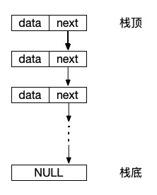
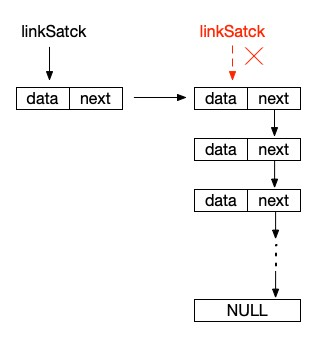

# 栈的相关逻辑操作

对于逻辑结构来说，我们也是从最简单的开始。堆栈、队列，这两个词对于大部分人都不会陌生，但是，堆和栈其实是两个东西。在面试的时候千万不要被面试官绕晕了。堆是一种树结构，或者说是完全二叉树的结构。而今天，我们主要讲的就是这个栈的应用。

## 什么是栈？

栈一般就是一种顺序的数据结构。它最大的特点就是后进先出（LIFO），或者反过来说先进后出（FILO）也是可以的。这两句话到底是什么意思呢？最典型的例子就是大家看电视剧时，特别是枪战片时绝对会看到的一样东西：弹匣。


弹匣在装弹的时候都是一个一个的将子弹压进弹匣的，也就是说，第一颗子弹是被压在最底下的，而开枪的时候则是按相反的顺序从弹匣的最顶部弹出来的，第一颗放进去的子弹是最后一个才被打出来的。

这个例子其实已经非常形象了，我们再统一一下术语。将子弹压进弹匣叫做“入栈”，第一颗子弹在最底下，这个位置叫做“栈底”，最后一颗子弹在最顶上，这个位置叫做“栈顶”，打出的这颗子弹是“栈顶”的那颗子弹，这个操作叫做“出栈”。

通过上面术语的定义，我们就可以看出，栈的逻辑操作主要就是“入栈”和“出栈”，而逻辑结构最需要关心的是这个“栈顶”和“栈底”在进行出入栈时的状态。当然，栈的逻辑结构使用顺序或链式结构都是没有问题的，我们就一个一个地来看一下。

## 顺序栈

首先还是比较简单的顺序栈的实现。既然是顺序结构，那么就是用数组了。不过，我们还需要记录一下“栈顶”或“栈底”的情况，所以我们将顺序栈的这个数组封装到一个类中。同时，在这个类中定义一个属性来标明当前栈的“栈顶”或“栈底”指针，其实就是当前“栈顶”或“栈底”在数组中的下标位置。通常来说，我们只需要记录“栈顶”的位置就可以了，将“栈底”默认为 -1 即可。因为数组下标本身是从 0 开始的，所以当“栈顶”属性为 -1 时，这个栈就是一个空栈，因为它的“栈顶”和“栈底”在一起，里面并没有元素。

```php
class SqStack
{
    public $data;
    public $top;
}
```

初始化顺序栈很简单，一个空的数组并将 $top 设置为 -1 。

```php
function InitSqStack()
{
    $stack = new SqStack();
    $stack->data = [];
    $stack->top = -1;
    return $stack;
}
```

接下来就是“入栈”和“出栈”的操作了，先看代码。

```php
function PushSqStack(SqStack &$stack, $x){
    $stack->top ++;
    $stack->data[$stack->top] = $x;
}

function PopSqStack(SqStack &$stack){
    // 栈空
    if($stack->top == -1){
        return false;
    }

    $v = $stack->data[$stack->top];
    $stack->top--;
    return $v;
}
```

入栈很简单，给数组元素添加内容，然后 $top++ 就可以了。不过如果是 C 语言的话，因为它有数组长度的限制，所以在入栈的时候，我们也需要判断一下栈是否已经满了。当然，在 PHP 中我们就没有这个顾虑啦。

顺序栈入栈图示


出栈的时候需要判断当前的栈是否已经空了，这个就不区分什么语言了，因为要是比 -1 还小的话，再次使用这个栈就会出现问题了。在出栈的时候如果栈已经空了就不要再给 $top-- 了，然后获取栈顶元素并返回就可以了。

顺序栈出栈图示


我们来看一下这个顺序栈的测试结果。

```php
$stack = InitSqStack();

PushSqStack($stack, 'a');
PushSqStack($stack, 'b');
PushSqStack($stack, 'c');

var_dump($stack);
// object(SqStack)#1 (2) {
//     ["data"]=>
//     array(3) {
//       [0]=>
//       string(1) "a"
//       [1]=>
//       string(1) "b"
//       [2]=>
//       string(1) "c"
//     }
//     ["top"]=>
//     int(2)
//   }

echo PopSqStack($stack), PHP_EOL; // c
echo PopSqStack($stack), PHP_EOL; // b
echo PopSqStack($stack), PHP_EOL; // a

var_dump($stack);
// object(SqStack)#1 (2) {
//     ["data"]=>
//     array(3) {
//       [0]=>
//       string(1) "a"
//       [1]=>
//       string(1) "b"
//       [2]=>
//       string(1) "c"
//     }
//     ["top"]=>
//     int(-1)
//   }
```

通过数组来操作栈是不是非常地简单。看完学习完链栈之后，我们还会讲到 PHP 已经为我们准备好的数组栈的操作函数哦，使用起来会更加的方便。

## 链栈

其实对于链式存储结构来说，核心的内容还是一样的，同样是要关心我们的栈顶，也同样要关心出入栈的操作。但是，在链式中，我们可以使有头插法，也就是让插入的数据保持在链的顶端来实现“栈顶”的效果。这样，我们就不需要一个专门的属性来保存当前的栈顶位置了。直接通过一个图来理解会更清晰。



```php
class LinkStack{
    public $data;
    public $next;
}
```

数据的结构就是一个典型的链式结构就可以了，主要还是看出入栈的操作是如何进行的。

```php
function InitLinkStack(){
    return null;
}

function PushLinkStack(?LinkStack &$stack, $x){
    $s = new LinkStack();
    $s->data = $x;
    $s->next = $stack;
    $stack = $s;
}

function PopLinkStack(?LinkStack &$stack){
    if($stack == NULL){
        return false;
    }
    $v = $stack->data;
    $stack = $stack->next;
    return $v;
}
```

在链栈中其实初始化空栈的操作意义不大。我们可以直接定义一个 null 变量然后针对它进行链式操作就可以了，但在这里我们还是与顺序栈保持统一。就像顺序栈中的栈底为 -1 一样，在链栈中，我们也约定好栈底为一个 null 对象节点。

接下来就是入栈操作了。这里我们使用的是头插法，其实就是将新元素放到链表的顶端。先实例化一个节点，然后将这个节点的 next 指向链表的头节点。接着再让当前这个节点成为链表的新的头节点，就像下图所示的那样。



同理，出栈的操作其实也是类似的，将头节点变成当前头节点的 next 节点，直到当前节点变成 null ，也就是栈已经空了，如图所示：


最后，我们同样的测试一下这一套链式栈的代码运行情况如何。

```php
$stack = InitLinkStack();

PushLinkStack($stack, 'a');
PushLinkStack($stack, 'b');
PushLinkStack($stack, 'c');

var_dump($stack);
// object(LinkStack)#3 (2) {
//     ["data"]=>
//     string(1) "c"
//     ["next"]=>
//     object(LinkStack)#2 (2) {
//       ["data"]=>
//       string(1) "b"
//       ["next"]=>
//       object(LinkStack)#1 (2) {
//         ["data"]=>
//         string(1) "a"
//         ["next"]=>
//         NULL
//       }
//     }
//   }

echo PopLinkStack($stack), PHP_EOL; // c
echo PopLinkStack($stack), PHP_EOL; // b
echo PopLinkStack($stack), PHP_EOL; // a

var_dump($stack);
// NULL
```

是不是很多小伙伴已经看出之前我们花费了 4 篇文章的时间来讲述线性结构中的顺序表和链表的重要作用了吧。它们真的是一切其它逻辑结构的基础。不光是栈，在队列、树、图中我们都会有不同结构的线性和链式的实现。当然，更重要的是能体会它们之间的区别，在不同的业务场景中，两种不同的存储结构可能真的会带来完全不一样的体验。

## PHP 为我们提供的数组栈操作

最后，我们简单的看一下在 PHP 中已经为我们准备好的两个数组操作函数。有了它们，对于顺序栈来说，我们的操作可以简化到非常傻瓜智能的效果。

```php
$sqStackList = [];

array_push($sqStackList, 'a');
array_push($sqStackList, 'b');
array_push($sqStackList, 'c');

print_r($sqStackList);
// Array
// (
//     [0] => a
//     [1] => b
//     [2] => c
// )

array_pop($sqStackList);
print_r($sqStackList);
// Array
// (
//     [0] => a
//     [1] => b
// )

echo count($sqStackList) > 0 ? $sqStackList[count($sqStackList) - 1] : false, PHP_EOL;
// b

array_pop($sqStackList);

echo count($sqStackList) > 0 ? $sqStackList[count($sqStackList) - 1] : false, PHP_EOL;
// c

array_pop($sqStackList);

print_r($sqStackList);
// Array
// (
// )
```

估计不少同学早就用过这两个函数了。array_push() 就是向数组中压入一个数据，其实说白了，增加一个数据到数组中而已，没什么特别稀罕的功能。而 array_pop() 则是将数组最后一个位置的数据弹出。是不是和我们上面自己实现的那个顺序栈是完全相同的概念。没错，既然语言环境已经为我们准备好了，那么除了在某些场景下需要链式结构的话，大部分情况下我们直接使用这两个函数就可以方便地实现 PHP 中的栈操作了。

## 总结

栈这个逻辑结构是不是非常的简单清晰呀，在日常应用中其实栈的使用非常广泛。比如算式中的前缀算式、中缀算式、后缀算式的转化，比如我们后面学习树、图时要接触到了BFS（深度搜索），再根据BFS引出递归这个概念。另外，在解析字符时的一些对称匹配、回文算法的判断等等，这些都是栈的典型应用。可以说，栈这个东西撑起了计算机算法的半壁江山。而另外半壁呢？当然就是我们下回要讲的：队列。

测试代码：

[https://github.com/zhangyue0503/Data-structure-and-algorithm/blob/master/3.栈和队列/source/3.1栈的相关逻辑操作.php](https://github.com/zhangyue0503/Data-structure-and-algorithm/blob/master/3.栈和队列/source/3.1栈的相关逻辑操作.php)

参考资料：

《数据结构》第二版，严蔚敏

《数据结构》第二版，陈越

《数据结构高分笔记》2020版，天勤考研