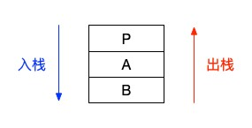
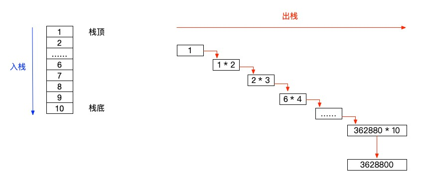
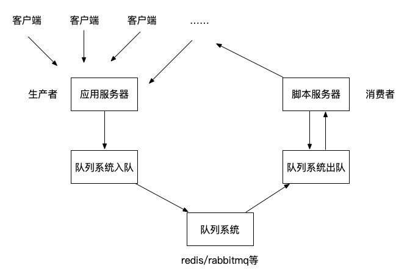

# 栈和队列的应用

通过栈和队列的学习，我们似乎会感觉到其实数据结构还是非常简单的嘛。当然，这只是一个开始，我们从顺序表、链表开始，到现在的栈和队列，其实都是为了将来在铺路。在树和图的遍历算法中，都可以见到栈和队列的身影。在这里，我们先简单的看看栈和队列的一些实际应用。

## 回文题

假设有一段文字，我们要判断它是不是“回文”（不是回族兄弟的文字）。就可以应用栈来解决这个问题。

回文指的就是将这段文字一分为二之后，前面一段内容和后面一段内容是完全相同的，但是顺序是相反的。比如非常出名的：上海自来水来自海上。上海自来，来自海上，这样的两段结构在一句话里就构成了一段回文。又比如双数长度的一段字符：abcddcba，这也是一段回文。

类似的这种题目其实很容易出现在一些简单的算法面试题中，相信也有不少小伙伴已经看出端倪了，我们可以将前半段入栈，然后再一个一个的出栈与后半段进行比对就可以判断当前的字符串是否是回文了。别光说不练，我们就上代码来实现。

```php
$string1 = 'abcdedcba';
$string2 = 'abcdeedcba';
$string3 = 'abcdefcba';

function getIsPlalindrome($string)
{
    if (gettype($string) != 'string') {
        return false;
    }
    $strlen = strlen($string);
    $mid = floor($strlen / 2);
    $arr = [];

    if ($strlen < 2) {
        return false;
    }

    // 入栈
    for ($i = 0; $i < $mid; $i++) {
        array_push($arr, $string[$i]);
    }

    $j = $mid;
    $i = $strlen % 2 == 0 ? $mid : $mid + 1; // $i 从中位数开始
    for (; $i < $strlen; $i++) {
        $v = $arr[$j - 1]; // 获得栈顶元素
        if ($v != $string[$i]) {
            return false;
        }
        array_pop($arr); // 弹出栈顶元素
        $j--;
    }
    if ($arr) {
        return false;
    }
    return true;
}

var_dump(getIsPlalindrome($string1)); // bool(true)
var_dump(getIsPlalindrome($string2)); // bool(true)
var_dump(getIsPlalindrome($string3)); // bool(false)
```

很简单吧，就是使用 array_push() 和 array_pop() 来进行的顺序栈的操作而已。唯一需要注意的就是对于字符长度奇偶数的不同，我们要取的中位数也相应的要发生改变。

回文算法还是比较简单的，另外还经常会出现的像是简单的括号匹配、算式运算、中缀转后缀表达式这类的题目都是栈的典型算法面试题。大家可以自行查找相关的内容来尝试尝试。

## 递归

在讲递归前，我们要弄清楚一件事情，那就是：编程语言中的函数调用本质上就是栈的调用。

怎么理解这句话呢？当我们执行代码时，如果遇到一个函数，总是会先进入到这个函数中，运行完这个函数中的代码之后才会再回到原来的代码执行线中继续执行调用当前这个函数的代码。比如下面这段代码。

```php
function testA()
{
    echo 'A start.', PHP_EOL;
    testB();
    echo 'A end.', PHP_EOL;
}
function testB()
{
    echo 'B start.', PHP_EOL;
    echo 'B end.', PHP_EOL;
}
echo 'P start.', PHP_EOL;
testA();
echo 'P end.', PHP_EOL;

// P start.
// A start.
// B start.
// B end.
// A end.
// P end.
```

当前页面 P ，在运行到 testA() 函数时，就进入了 testA() 函数内部执行其内部的代码，也就是 P -> A 。然后 testA() 函数又调用了 testB() 函数，那么现在就进入了 testB() 中并执行该函数体内的代码，也就是 P -> A -> B 。当 testB() 的代码运行完成后，返回到 testA() 继续执行 testA() 函数体里面的内容，最后回到页面 P 继续向下执行，也就是 B -> A -> P 。

上面这段描述如果一次没看明白的话，请再多看几次，细细品。这不就是一个栈的调用过程嘛！！



这么一看，在编程语言中，栈还真是深入骨髓般的存在。因为你只要是在开发代码，那么你一定就是在运用栈这个东西了。而“递归”，则是栈的更典型的实现。

```php
function recursion($n)
{
    if ($n == 0 || $n == 1) {
        return 1;
    }
    $result = recursion($n - 1) * $n;
    return $result;
}

echo recursion(10), PHP_EOL;
```

这是一段简单的阶乘算法的递归实现，由于递归会建立一个栈，所以我们这段代码最先计算出来的是的栈底的 n 是 1，出栈返回 1 之后，再出栈时就是用 1 乘以 2 ，再继续出栈就是 2 乘以 3 ，依次类推，直到计算出从 1 到 10 的阶乘结果。



递归相关的面试题也是我们在面试中非常常见的内容，所以我们一定要把握好递归其实就是栈的一种表现形式，然后运用栈的思想来解构整个递归的调用过程。

## 队列应用

最后，我们再讲讲队列的一些实际应用。队列在代码层面其实并没有太多很好的示例，比较常见的可能有两个队列合并出队（舞伴问题）或者两组队列一起出队，一边出两个另一个才能出一个之类的这种问题。大家可以自行查找一下相关的题目。相对来说，队列的算法题在面试题中还是比较少的，包括在考研的时候也多是以选择判断之类的题目出现的。不过，在实际应用中，队列现在却是解决高并发问题的超级法宝，也是面试官判断你经验的一个重要内容。

在实际的项目开发中，队列最典型的一个功能就是秒杀问题。就像抢火车票或者抢小米手机一样，在整点的时候，大量的请求涌入，如果仅仅依靠服务器来处理，超高的并发量不仅会带给服务器巨大压力，而且还有可能出现各种高并发场景下才会出现的问题，比如超卖、事务异常等。（多个线程同时更新数据）

而队列，正是解决这个问题的一把好手。通常我们会使用的队列系统（redis、rabbitmq）都是以内存为主的队列系统，它们的特点就是存储非常快。由前端（生产者）生成的大量请求都存入队列中（入队），然后在后台脚本（消费者）中进行处理（出队）。前端只需要返回一个正在处理中，或者正在排队的提示即可，然后后台处理完成后，通知前台显示结果。这样，在一个秒杀场景中基本上就算是解决了高并发的问题了。当然，现实环境可能还需要考虑更多因素，但核心都是以队列的方式来解决这种瞬间高并发的业务功能。



另外，队列还有一个重要的业务场景，那就是通知、消息、邮件、短信之类的这种信息发送。因为队列的所能解决的一些问题的最大特点就是需要生产者/消费者的业务解耦。通常我们在群发消息时都会批量进行大规模的发送，这时就只需要准备好消息内容和对应的手机号、设备id，就可以让系统在后台队列中慢慢进行消息发送了，而不需要我们的前端一直等待消息全部发送完成。

这时，不少小伙伴又看出了一点点门道了。队列这货在实际应用中，就是多线程的感觉呀，JS 中的事件回调，CPU 的碎片时间轮询可不就是一种队列的真实应用嘛。还有设计模式中的“观察者模式”，本身就是事件回调这种机制的一种编程范式，所以，用它来实现的很多功能中，我们都能看到队列的影子。

## 总结

看看，一个栈，一个队列，竟然都是我们在开发过程中天天要接触的东西。是不是感觉自己的脑容量不够用了？仔细再想想，还有哪些东西和我们的栈、队列有关呢？其实只要把握住它们的两个本质就可以了：栈是后进先出（LIFO）或者说是先进后出（FILO），而队列是先进先出（FIFO）。

测试代码：


参考资料：

《数据结构》第二版，严蔚敏

《数据结构》第二版，陈越

《数据结构高分笔记》2020版，天勤考研