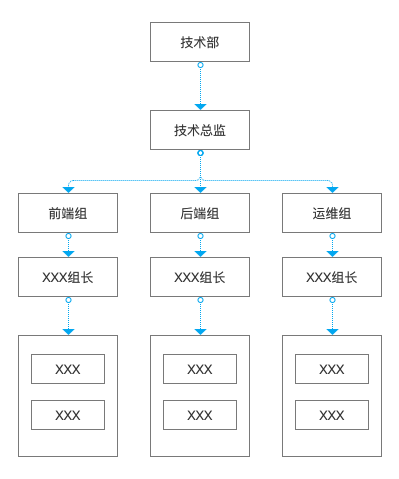

# 树和二叉树

树的概念其实非常地广泛，也非常地常见，大家见到这个词千万不要惊慌，因为真的每天你都能见到树结构在我们生活中的应用。比如说公司的组织结构：

另外像我们家里的族谱，或者说是我们的家庭结构，也是一个典型的树结构。此外，在计算机领域，我们天天要打交道的【文件夹】、数据库中我们存储的数据，都是树的典型的应用。今天我们来学习的就是比较偏理论的关于树和二叉树的定义以及它们的一些属性特点。

# 树

从上面实际生活中的例子里，我们可以看出，树这种结构是可以归纳出它的一些特点的。

> 树 （Tree）是 N (N>0)个结点的有限集，它或为空树（N=0）;或为非空树 T 。

在这个定义中，我们需要明确两个问题：一是树一定是有结点的，二是根据结点数量可以分为空树和非空树两种。不过这只是最基本的定义，它还有一些特性。

> 有且仅有一个称之为根的结点。

也就是说，这个树一定是从某一个结点开始扩展出来的，这个结点就向树根一样。从它开始向外开枝散叶。

> 除根结点以外的其余结点可分为 m ( m > 0 ) 个互不相交的有限集 T1，T2 ……，Tm 其中每一个集合本身又是一颗树，并且称为根的子树（SubTree）

这一段可能会不太好理解，其实说白了就是每个结点只有一个上级结点，不能有多个上级结点。同理，平级结点之间也不能有联系，但是它可以有多个下级结点。

关于树的定义我们可以看下下面这个图。

上图中简单的列举了标准的树和不标准的树是什么样子的。其中：

- (a) ，是只有一个根结点的树，只要有一个结点，它就可以称为一个树结构

- (b) ，是一个标准的树结构

- (c) ，注意它的 C 和 H 结点之间有一条连接线，这个就不是树了，结点只能有一个上级结点的才称为树，这个其实就是我们将来要学的【图】了

## 树的相关术语

相对于栈的压（入）栈、出栈，队列的入队、出队来说，树的相关术语可就复杂的多了。不论如何，首先你得先记住这些术语，要不后面讲的东西用得那些术语只会让你更晕。不过我们一时记不住也没关系，先有个大概的印象，在后面的学习进程中遇到了再回来复习，这样印象反而会更加深刻。

- 结点：一个结点可能包含一组数据，或者指向其它结点的分支，可以看作是树枝分叉的那个地方，(b)图中 A、 B、 C、 D、 E 等等这些都是结点

- 结点的度：结点拥有的子树数量就叫做结点的度，其实就是它的下级子结点有几个就是几度，(b)图中，C 结点的度为 1 ， D 结点的度为 3

- 树的度：树内各结点度的最大值，就是拥有最多子结点的度是多少，这个树的度就是多少，(b) 图这个树的度为 3

- 叶子：度为0的结点，也就是没有子结点的结点，(b) 图中的 K 、 L 、 F 、 G 、 M 、 I 、 J 就是这颗树的叶子结点

- 双亲和孩子：一个结点的子结点，就是它的孩子；对于这些子结点来说，当前这个结点就是它的双亲，(b) 图中，D 的孩子是  H 、 I 、 J ，而  H 、 I 、 J 的双亲就是 D

- 层次：从根结点算起，根结点就是第一层，根的孩子就是第二层，依次类推，(b) 图中 G 结点所在的层次为 3 ，(a) 图的全部层次都只有 1 

- 树的深度（高度）：当前这颗树的最大层次，很明显，(b) 图的深度就是 4

- 兄弟、祖先和子孙：兄弟结点就是这些结点的双亲是同一个结点；祖先结点就是从根结点到某个指定结点路上的经过的所有结点；子孙就是从某一个节点出发，到达目标结点这一路上的所有结点。(b) 图中， E、 F 是兄弟，E 的祖先是 A 、 B ， E 的子孙为 K 或者 L

- 堂（表）兄弟：所有在同一层的结点但双亲不同的结点都是堂兄弟，同样还是在 (b) 图中，G 的堂（表）兄弟有  E、 F ，另外还有   H 、 I 、 J 也是它的表兄弟

## 二叉树

对于树的概念有了一定的了解之后，我们再来进一步的学习另一个概念，同时也是在数据结构和算法中最重要的一种树的形式：二叉树。

通常来说，树的形态是可以千变万化的，比如一个结点可以有 3 个子结点，而另一个结点可能有 300 个子结点。这样没有什么规则的树其实操作起来会非常麻烦，而二叉树的定义就要简单的多，除了有树的性质外，它还多了一项内容：二叉树的每个结点最多只有两个子结点，也就是说，整个二叉树的度肯定是 2 ，所有结点的度也不会超过 2 。关于二叉树为什么好操作这点，我们在下一小节的二叉树的性质中再详细地说明。所有的树结构都是可以通过一定的规则变形来转换成二叉树的。

我们同样还是通过一张图示来展示什么是二叉树。

二叉树中，左边的子结点及其子孙结点可以看成是关于当前结点的左子树。右边结点及其子孙结点也一样可以看成是当前结点的右子树。根据结点的子结点情况，就有了上面图中的这几种二叉树形态。

- (a) 树是仅有一个结点的树，也可以说是仅有一个结点的二叉树

- (b) 树是仅有一个左结点的二叉树

- (c) 树是仅有一个右结点的二叉树

- (d) 树是拥有左右两个结点的二叉树

## 二叉树的性质

> 性质1：在二叉树的第 i 层上至多有 2i-1 个结点（ i >= 1 ）

> 性质2：深度为 k 的二叉树至多有 2k - 1 个结点（ k >= 1）

> 性质3：对任何一颗二叉树 T ，如果其终端结点数为 n0 ，度为2的结点数为 n2 ，则 n0 = n2 + 1

> 性质4：具有 n 个结点 的完全二叉树的深度为 log2n + 1

> 性质5：如果对一颗有 n 个结点 的完全二叉树（其深度为 log2n + 1 ）的结点按层序编号（从第1层到第 log2n + 1 层，每层从左到右），则对任一结点 i （ 1 <= i <= n），有：

1. 如果 i = 1 ，则结点 i 是二叉树的根，无双亲；如果 i > 1 ，则其双亲是结点 i / 2

2. 如果 2i > n ，则结点 i 无左孩子（结点 i 为叶子结点）；否则其左孩子是结点 2i

3. 如果 2i + 1 > n ，则结点 i 无右孩子；否则其右孩子是结点 2i + 1

关于二叉树的上述五个性质的数学证明我们就不详细说了，毕竟我们这一系列的文章的宗旨也是希望通过简单的示例让大家学习到数据结构和算法的精髓，而不是简单粗暴的直接用数学公式来推导证明，那么我们就直接来图上数一数就好了。

- 对于 性质1 来说，我们当前这个二叉树根据公式的话，在第 3 层上最多只能有 23-1 个结点，也就是 4 个结点。第 4 层上最多只能有 24-1 ，也就是 23 = 8 个结点

- 对于 性质2 来说，当前这图中的树的深度为 4 ，也就是最多有 24 - 1 = 15 个结点

- 性质3 的话，我们先数数度为 2 的结点有多少，在这个图中，度为 2 的结点有 7 个，也就是 A 、 B 、 C 、 D 、 E 、 F 、 G ，第 4 层的结点都是没有子结点的，也就是说它们都是 0 度的，也称为终端结点（叶子结点），这些结点的数量一共是 8 个。现在 n2 = 7 ，根据性质公式就可以得出 n0 = n2 + 1 = 7 + 1 = 8 

- 图中的结点数量为 15 个，套用 性质4 的公式可以得出 log2n + 1 = log215 + 1 = 3.91（向下取整） + 1 = 3 + 1 = 4 ，当前树的深度即为 4 ，性质4 和 性质2 可以看作是互补的

- 对于 性质5 来说，请注意每个结点边上的编号，我们就选取 E 结点来作为例子说明。E 结点当前为 5 ，所以它的双亲为 5 / 2 = 2 （向下取整）；E 的左孩子为 2i ，也就是 2\*5=10 ，E 的右孩子为 2i + 1 ，也就是 2\*5+1 = 11；性质5 的定义中说得更抽象一些，而且是拿叶子结点来做说明的，针对的是整个二叉树的情况，但其实意思和我们这里解释的是一样的，大家可以再拿其它结点验证一下。性质5 对于后面我们要讲的使用顺序结构来存储二叉树非常重要！

请务必掌握并记牢二叉树的这五个性质及其含义，因为在后面的学习中，不管是二叉树的顺序、链式存储结构，还是二叉树的遍历，都有可能会接触到上面的五个性质中的内容。可以说，它们就是二叉树学习中最最基础的灵魂。

## 森林

最后，我们来简单的了解下什么是“森林”。多个树放在一起，就形成了一片“森林”。就像上文中二叉树的解释图一样，(a)(b)(c)(d)放在一起将它们整体一起来看，就是一片“森林”，在这片“森林”中分别有着(a)(b)(c)(d)这四颗树。森林中的树和树之间是没有联系的，如果我们要操作或者遍历一个森林的话，往往是将这片森林转化为一颗树。具体的算法和步骤不是我们学习的重点，所以大家了解一下即可，有想深入研究的同学可以搜索相关的内容或者查阅相关的教材。

## 总结

从栈和队列前进到树后，是不是突然感觉到一下子就迈了一大步？有点搞不懂了？没关系，今天的内容其实都是一些基础的理论内容，能理解的就理解，不能理解的就接着继续学习之后再返过来看今天的这些概念。学习就不不断地重复进步地过程，当然一切都还是要以地基为基础的。当你了解了树的数据结构及一些简单的遍历算法之后，再回来深入的理解这些概念并把他们背下来，相信一般的面试中关于树相关的题目就不在话下了，一起努力吧！

参考资料：

《数据结构》第二版，严蔚敏

《数据结构》第二版，陈越

《数据结构高分笔记》2020版，天勤考研

