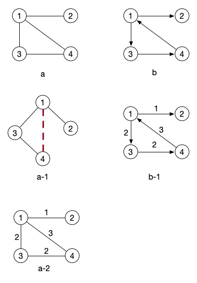
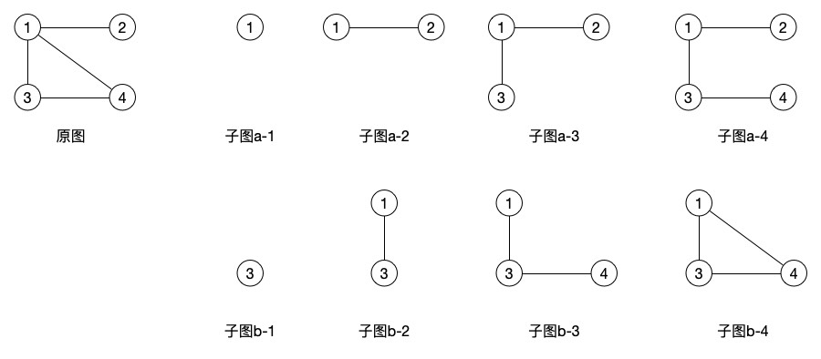
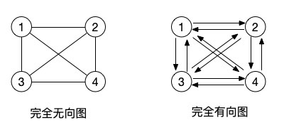
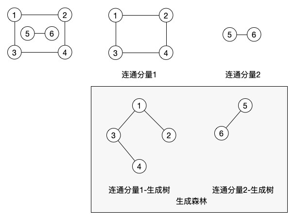

# 图的概念和存储结构

随着学习的深入，我们的知识也在不断的扩展丰富。树结构有没有让大家蒙圈呢？相信我，学完图以后你就会觉得二叉树简直是简单得没法说了。其实我们说所的树，也是图的一种特殊形式。

## 图的概念

还记得我们学习树的第一篇文章时看到的那张关于树的图片吗？

在当时，我们就说过，图c 不是一颗树，而是一个图。为什么呢？从树的定义我们可以看出，树只能有一个根结点，平级之间不能有联系，可以有多个子结点。而图就不用遵守这些规则，图的特点就是结点之间都可以互相有联系。比如下图这样的都是图。

在上面所画的图中，图b 是的箭头的，而 图a 的连接线是没有箭头的，像这样有明确的方向的指向的图就叫做 有向图 。而没有箭头的，也就是没有方向指向的图就叫作 无向图 。

我们先将目光移到 图a-1 ，其实它就是把 图a 旋转了一下。大家能看出来了吗？如果忽略掉结点 4 和 1 之间的连线，那么它就是一颗树。是不是和我们上面关于树的图中的 图c 的概念一致了。

关于图的比较正式的官方定义是：

> 图（Graph）G 由两个集合 V 和 E 组成，记为 G=(V, E) ，其中 V 是顶点的有穷非空集合，E 是 V 中顶点的有穷集合，这些顶点偶对称为边。

在 有向图 中，连接两点的那个线段，从开始的结点到指向的那个结点可以记为 <x, y> 。<x, y> 和 <y, x> 是两个不同的边，也可以叫作 弧 。根据 图a ，我们可以看到这个图中有 <1, 2> 、 <2, 1> 、 <1, 3> 、 <3, 1> 、 <1, 4> 、 <4, 1> 、 <3, 4> 、 <4, 3> 这几条边。而 图b 中，因为它是有向图，所以它的边只有 <1, 2> 、 <1, 3> 、 <3, 4> 、 <4, 1> 这四条。

是不是感觉在看上面的图片的时候还比较清晰，一看这个定义就一脸懵逼了？像这种定义，如果你是需要考试的同学，那就还是要背下来的。如果只是像我一起想以学习应用或者了解为主的话，就不用去死记硬背了。V 就是结点，E 就是这些这些结点之间的关系，两个顶点之间的关系，也就是图上的那些连接结点的线段就是边。

OK，这三个最最基础的概念搞明白了，我们就继续学习其它的和图有关的那一大车术语！

## 图的相关术语

首先，我们用 n 来表示图中顶点的数目，用 e 来表示边的数目，记住这两个代号。

- （1）子图：假设有两个图 G=(V, E) 和 G'=(V', E') 如果 V' 包含于 V 且 E' 包含于 E ，则称G' 为 G 的子图

上图中右边的那些子图都是属于原图的子图，可以看出子图可以产生非常多的形态，有向图 也是相同的概念，不过相对于 无向图 来说，有向图能够生成的子图更少一些，因为它的边是有方向的。

- (2) 无向完全图和有向完全图：对于无向图，若具有 n(n-1)/2 条边，就是无向完全图。对于有向图，若具有 n(n-1) 条孤，就称为有向完全图。（参考完全二叉树）

其实完全图的概念就是图中所有相邻的结点都有边能够连结在一起。

对于 有向图 来说，虽说边是有方向的，当然我们也可以定义一个来回的方向，比如 <1, 2> 和 <2, 1> ，在有向图中我们就要画上两个相反方向的箭头表示可以从1到2也可以从2到1。而 无向图 中则是用一个边来代替这两个边的概念了，本身的那一条没有箭头方向的边就是双向的。

- (3) 稀疏图和稠密图：有很少条边或孤（如e<nlog2n）的图称为稀疏图，反之称为稠密图

- (4) 权和网：在实际应用中，每条边或孤可以标上具有某种意义的值，就像地图上的距离一样，这些数值就称为权。带权的图就可以称为网

最上方的的图片上 图a-2 和 图b-1 的边上的数字代表的就是权重。这两张图就可以称为网图。权重的概念我们后面在讲相关的算法时会学习到，从这两张图中，我们其实就可以很明显的看出，如果要从 结点1 走到 结点4 的话，并不是直接走 <1, 4> 这条边，而是走 <1, 3> 、 <3, 4> 这条路线更快些。

- (5) 邻接点：两个有边的结点就是邻接点

- (6) 度、入度和出度：顶点 v 的度就是指和 v 相关联的边的数目。对于有向图来说，箭头指向其它结点的就是出度，指向自己的就是入度

还是继续来看 图b 。结点1 有两个出度，一个入度。这个貌似不用解释太多了吧。

- (7) 路径和路径长度：从某一个顶点到另一个顶点所经过的所有顶点就是路径。如果是有向图，那么它的路径就是按照箭头的方向。路径长度就是一条路径上经过的边或孤的数量

- (8) 回路或环：第一个顶点和最后一个顶点相同的路径称为回路或环

- (9) 连通、连通图和连通分量：如果某两个结点之间是有路径的，就称这两个结点是连通的。如果整个图中所有的结点都可以是互相连通的，则这个图就是连通图。连通分量就是无向图非连通图中的极大连通子图。

包括后面的三个概念也在这张图中一并给出了。在 无向图 中，连通分量就等于极大连通子图，在这个图中，我们有两个连通分量。

- (10) 极大连通子图：连通子图所能含有的最大结点数，如果再增加一个结点那么这个子图就不是连通图了

- (11) 生成树：一个极小连通子图，它含有图中全部的顶点，但只有足以构成一颗树的 n-1 条边，这样的连通子图就是连通图的生成树

其实就是通过一条路径，能够让图中所有的结点串联起来。在连通分量的图中，我们就根据两个连通分量生成了两个最小生成树。它们的 连通分量1 的生成树的结点并不一定非要是这种结构，我们可以让 结点4 在 结点2 下，这取决于我们如何遍历来生成这颗最小生成树。

最上面我们的 图a 的最小生成树其实就可以是 图a-1 去掉那条红色虚线。当然，也可以让 结点4 也在 结点1 下面，同样也是取决于我们的程序要如何遍历图来生成什么样的树。

- (12)生成森林：在非连通图中，每一个连通分量都可以生成一个连通生成树，这样就构成了整个非连通图的生成森林

是不是看完之后晕头转向了？没关系，这些术语我们在后面的学习中将会经常用到，而且这还不是最全面的。大家可以根据参考书目和其它学习资料来对图的相关术语进行更加深入的学习和理解。

## 总结

图的概念介绍得差不多了，大家可以消化消化再继续学习后面的内容。这只是个开始，不少同学会不会觉得这玩意对比 树 结构一下子又提升了好多。不用怕，在学习完后面的知识后，即使你暂时还没有搞明白 图 相关的内容，但你一定对 树 结构的理解会更加深入了。为什么呢？树 其实就是没有回路的图，它们的遍历无外乎都是通过深度或者广度来实现的，只是图更复杂一点而已。这下是不是感觉未来还是有点希望的啦？学习，往往是一个渐进的过程，当前的知识和过去的知识总会有所关联的，先不用想太多，一步一步的踏实走下去吧！

参考资料：

《数据结构》第二版，严蔚敏

《数据结构》第二版，陈越

《数据结构高分笔记》2020版，天勤考研