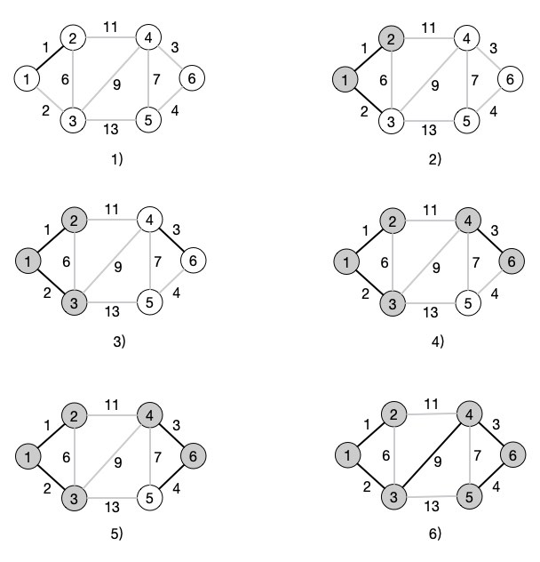

# 图的应用：最小生成树

在学习了图的基本结构和遍历方式后，我们再继续地深入学习一些图的基本应用。在之前的数据结构中，我们并没接触太多的应用场景，但是图的这两类应用确是面试或考试中经常出现的问题，而且出现的频率还非常高，真得不得不来好好说一说。

## 什么是最小生成树？

从前面的学习中，我们应该能够发现，图就是一种扩展的树结构。对于树来说，它只有一个上级结点，同级结点之间没有关联。而图则打破了树的这些规则。我们再反过来想想，能不能给定一个条件，那就是连接上所有的结点，但是每个结点之间只保留一条边。这样形成的一颗简单的树其实就是能够串联所有结点的一条路径，而最小生成树的概念，其实就是对于有权图来说，权数最少的那条能够串连起所有结点的边的路径，或者也可以说是最小连通树、最小连通子图、最小代价树。


从上图中就可以看出，对于一个有权图来，可以有许多生成树的方式，不过不同的路线方式的结果会不同，只有最后一个路径形成的生成树具有路径最小的那颗树，就是我们需要的最小生成树。

为什么要强调是有权图呢？因为如果是无权图，所有结点连接起来的方案其实就没有什么太大的意义了，因为不管从哪个结点出发走哪条路径可能权值都是一样的。而带路径的则总会有一条最佳的路径是可以将所有结点遍历完成并且权数还是最小的。最典型的应用就是地图上哪条线路成本最少呀，办公楼布线怎么走线最经济之类相关的题目，基本都会牵涉到最小生成树的概念。

关于最小生成树的最经典的算法，Prim 和 Kruskal 这两个大神级别的算法是绕不过去的槛，下面我们就来粗浅地学习一下。

## 第一种算法 Prim

Prim 算法，中文名 普里姆 算法。起源就不多说了，反正是个人名，这篇文章和下篇文章中图的应用的这些算法都是人名相关的。不用想也知道都是各类大神，他们发现并最初使用了这些算法，然后就将这些算法以他们的名字命名了。

Prim 算法的核心思想就是：从一个结点出发，查看这个结点的所有的边中权值最小的那条边，然后加上这条边所连接的那个结点的所有边，再一起看哪个边的权值最小，然后一直重复这些步骤，反正就是所有结点到我们出发的这个结点中所有权值最小的边都看一遍，并且让它们能够连接所有结点就完成了。


看图是不是就清晰多了。我们一步一步地看。

- 1) 首先我们从第 1 个结点出发，然后看第 1 个结点相关的边哪个权值最小，很明显，我们要选选择 <1, 2> 这条边，然后将结点 2 加入到选择中

- 2）在结点 1 和结点 2 中选择最权值最小的边并连接到新的结点，在这里我们选择的是 <1, 3> 这条边，于是结点 3 也加入到选择中

- 4）在结点 1、2、3 的所有边中，选择权值最小的边，可以看到 <2, 3> 这条边的权值最小，但是 2 和 3 都已经连通了，所以选择下一个最小的边 <3, 4> ，结点 4 还没有加入到已经连通的结点中，于是就走 <3, 4> 这条边，结点 4 加入已连通结点中

- 5）同样地，在结点 1、2、3、4 中选择权值最小的边，这时只有 <4, 6> 边是最小的，并且结点 6 也没有加入到已连通结点中，选择这条路线，结点 6 加入连通结点中

- 6）最后，在结点 1、2、3、4、6 中查找权值最小的边，得到 <6, 5> 这条边，结点 5 也没连通，于是选择这条路径，加入结点 5 

- 7）所有结点都已经连通，权值累加结点为 19 ，当前的这条路径就是最小权值路径，所形成的这一条路径就是一颗最小生成树了

从这个步骤和图释来说，大家可以自己尝试写写这个 Prim 算法的代码，其实并不复杂。我们需要一个集合来放置已经连通的结点信息，当查找路径的时候找到的最小权值路径连通的结点不在集合中，就加入到集合中。然后不断累加所有的路径权值，最后就得到了遍历整张图的最小生成树路径。

```php
// 普里姆算法
function Prim($graphArr)
{
    $n = count($graphArr);
    // 记录 1 号顶点到各个顶点的初始距离
    $dis = [];
    for ($i = 1; $i <= $n; $i++) {
        $dis[$i] = $graphArr[1][$i];
    }

    // 将 1 号顶点加入生成树
    $book[1] = 1; // 标记一个顶点是否已经加入到生成树
    $count = 1; // 记录生成树中的顶点的个数
    $sum = 0; // 存储路径之和
    // 循环条件 生成树中的顶点的个数 小于 总结点数
    while ($count < $n) {
        $min = INFINITY;
        for ($i = 1; $i <= $n; $i++) {
            // 如果当前顶点没有加入到生成树，并且记录中的权重比当前权重小
            if (!$book[$i] && $dis[$i] < $min) {
                // 将 $min 定义为当前权重的值
                $min = $dis[$i];
                $j = $i; // 用于准备将顶点加入到生成树记录中
            }
        }
        $book[$j] = 1; // 确认将最小权重加入到生成树记录中
        $count++; // 顶点个数增加
        $sum += $dis[$j]; // 累加路径和
        // 调整当前顶点 $j 的所有边，再以 $j 为中间点，更新生成树到每一个非树顶点的距离
        for ($k = 1; $k <= $n; $k++) {
            // 如果当前顶点没有加入到生成树，并且记录中的 $k 权重顶点大于 $j 顶点到 $k 顶点的权重
            if (!$book[$k] && $dis[$k] > $graphArr[$j][$k]) {
                // 将记录中的 $k 顶点的权重值改为 $j 顶点到 $k 顶点的值
                $dis[$k] = $graphArr[$j][$k];
            }
        }
    }
    return $sum;
}

$graphArr = [];
BuildGraph($graphArr); // 之前文章中的生成邻接矩阵的函数

echo Prim($graphArr); // 19
```

我们运行代码并输入测试数据。

```shell
php 5.4图的应用：最小生成树.php
请输入结点数：6
请输入边数：9
请输入边，格式为 出 入 权：2 4 11
请输入边，格式为 出 入 权：3 5 13
请输入边，格式为 出 入 权：4 6 3
请输入边，格式为 出 入 权：5 6 4
请输入边，格式为 出 入 权：2 3 6
请输入边，格式为 出 入 权：4 5 7
请输入边，格式为 出 入 权：1 2 1
请输入边，格式为 出 入 权：3 4 9
请输入边，格式为 出 入 权：1 3 2
19
```

可以看到输出的结果和我们预期的一样。代码中已经有很详细的注释说明了，如果直接看代码比较晕的话，大家可以拿调试工具进行断点的单步调试来看一下具体的运行情况。在这里我们先看一下那个 \$dis[] 中最后都保存了什么东西。

```shell
Array
(
    [1] => 9999999
    [2] => 1
    [3] => 2
    [4] => 9
    [5] => 4
    [6] => 3
)
```

INFINITY 是我们定义的一个常量，在初始化 $graphArr 这个邻接矩阵时，将所有的边都设置为 INFINITY 了，主要就是方便我们后面进行最小值的比对。这个 INFINITY 我们设置的是 9999999 这样一个非常大的数。$dis[] 中其实包含的就是结点 1 所经过的每条边所选择的权值，把他们加起来就是我们的最终路径长度。

## 第二种算法 Kruskal

Prim 算法好玩吗？相信通过具体的算法你对最小生成树的概念就更清晰了，不知道你会不会有个这样的想法：直接遍历所有的边，给他们按权值排序，这样我们再依次遍历这个排序 后的边结构数组，然后将边的结点加入到最终要生成的树中，这样不也能形成一个最小生成树嘛！哇塞，你要是真的想到这个方案了那要给一个大大地赞了。这种方式就是我们最小生成树的另一种明星算法：Kruskal 算法。它的中文名字可以叫做 克鲁斯卡尔 算法。



看这个步骤是不是和 Prim 就完全不一样了？不急，我们还是一步一步地来看。

- 1）在所有的边中，选择最小的那条边，也就是 <1, 2> 这条边，结点 1 和结点 2 连通

- 2）接着选择第二小的边，<1, 3> 边符合条件，并且结点 3 没有连通，加入结点 3

- 3）继续选择最小的边，此时最小的边是 <4, 6> ，这两个结点都没有连通，直接加入

- 5）接下来是 <6, 5> 这条边最小，继续连通并将结点 5 加入

- 6）好了，左右两边成型了，现在最小的边是 <2, 3> 边，不过结点 2 和结点 3 已经连通了，放弃！选择 <4, 5> 边，同样，结点4 和结点 5 也已经连通了，放弃！选择 <3, 4> 边，OK，这两条边还没有连通，直接连通，所有结点连通完毕，最小生成树完成！

不错吧，又学会一个新的套路，大家也可以试试按照上面的步骤和图释来自己先写写代码。需要注意的我们要先给所有的边排序，才能进行这个算法的操作。另外，每次判断结点连通也是一件费事的工作，使用深度优先或者广度优先遍历是没问题的，但效率太低，让我们看看大神（算法书中）们是怎么做的。

```php
// 克鲁斯卡尔算法
function Kruskal($graphArr)
{
    global $map, $f;
    $hasMap = [];
    $i = 1;
    // 转换为序列形式方便排序
    // O(mn)或O(n^2)，可以直接建图的时候使用单向图进行建立就不需要这一步了
    foreach ($graphArr as $x => $v) {
        foreach ($v as $y => $vv) {
            if ($vv == INFINITY) {
                continue;
            }
            if (!isset($hasMap[$x][$y]) && !isset($hasMap[$y][$x])) {
                $map[$i] = [
                    'x' => $x,
                    'y' => $y,
                    'w' => $vv,
                ];
                $hasMap[$x][$y] = 1;
                $hasMap[$y][$x] = 1;
                $i++;
            }
        }
    }
    // 使用快排按照权重排序
    quicksort(1, count($map));

    // 初始化并查集
    for ($i = 1; $i <= count($graphArr); $i++) {
        $f[$i] = $i;
    }

    $count = 0; // 已记录结点数量
    $sum = 0; // 存储路径之和
    for ($i = 1; $i <= count($map); $i++) {
        // 判断一条边的两个顶点是否已经连通，即判断是否已在同一个集合中
        if (merge($map[$i]['x'], $map[$i]['y'])) { // 如果目前已连通，则选用这条边
            $count++;
            $sum += $map[$i]['w'];
        }
        if ($count == count($map) - 1) { // 直到选了n-1条边后退出
            break;
        }
    }
    return $sum;
}
```

Oh my God！代码多了好多，还有好多莫名其妙的东西出现了。在上文中说过，我们要使用 Kruskal 算法就得先给边排序。所以我们先将邻接矩阵转换成 $map[x,y,w] 的形式，x 和 y 依然是代码两个结点，而 w 代表权重。这样的一个可以看成是边对象的数组就比较方便我们进行排序了。

接着我们使用快速排序按照权值进行排序，具体的快排算法我们在后面学习排序的时候再详细说明，大家可以直接在文章底部复制测试代码链接查看完整的代码。

接下来就是使用并查集进行 Kruskal 算法的操作了。并查集就是代替深度和广度优先遍历来快速确定结点连通情况的一套算法。

```php
$f = [];

// 并查集寻找祖先的函数
function getf($v)
{
    global $f;
    if ($f[$v] == $v) {
        return $v;
    } else {
        // 路径压缩
        $f[$v] = getf($f[$v]);
        return $f[$v];
    }
}

// 并查集合并两子集合的函数
function merge($v, $u)
{
    global $f;
    $t1 = getf($v);
    $t2 = getf($u);
    // 判断两个点是否在同一个集合中
    if ($t1 != $t2) {
        $f[$t2] = $t1;
        return true;
    }
    return false;
}
```

它本身还是通过递归的方式来将结点保存在一个数组中，通过判断两个点是否在同一个集合中，即两个结点是否有共同的祖先来确定结点是否已经加入并且连通。

关于并查集的知识本人掌握的也并不是很深入，所以这里就不班门弄斧了，大家可以自己查阅相关的资料或者深入研究各类算法书籍中的解释。

最后运行代码输出的结果和 Prim 算法的结果是一致的，都是 19 。

## 总结

怎么样？最小生成树是不是很好玩的东西，图的结构其实是很复杂的，不过越是复杂的东西能够玩出的花活也越多。但是反过来说，很多公司的面试过程中关于图的算法能考到这里的也都是大厂了，一般的小公司其实能简单地说一说深度和广度就已经不错了。我们的学习还要继续，下一篇我们将学习的是另一个图的广泛应用：最短距离。

今天的测试代码均根据 《啊哈！算法》 改写为 PHP 形式，参考资料依然是其它各类教材。

测试代码：


参考文档：

《数据结构》第二版，严蔚敏

《数据结构》第二版，陈越

《数据结构高分笔记》2020版，天勤考研

《啊哈！算法》