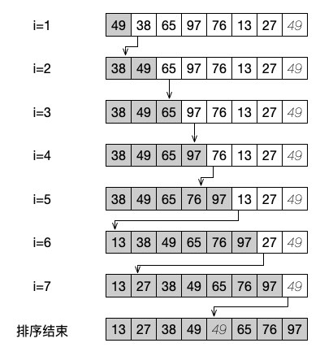
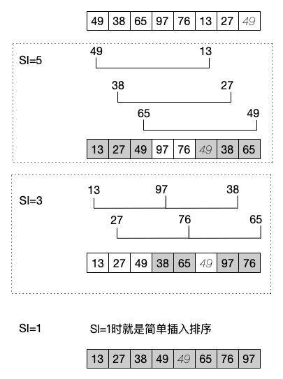

# 插入类排序：简单插入、希尔排序

总算进入我们的排序相关算法的学习了。相信不管是系统学习过的还是没有系统学习过算法的朋友都会听说过许多非常出名的排序算法，当然，我们今天入门的内容并不是直接先从最常见的那个算法说起，而是按照一定的规则一个一个的介绍。

首先，我们要介绍的排序算法是插入类型的排序算法。顾名思义，插入排序就是将无序的一个或几个记录“插入”到有序的序列中，比较典型的例子就是简单插入排序和希尔排序。

## 简单插入排序

简单插入排序，也可以叫做直接插入排序。还是先看代码，再来进行下一步的解释。

```php
function InsertSort($arr)
{
    $n = count($arr);
    for ($i = 1; $i < $n; $i++) { // 开始循环，从第二个元素开始，下标为 1 的
        $tmp = $arr[$i]; // 取出未排序序列第一个元素
        for ($j = $i; $j > 0 && $arr[$j - 1] > $tmp; $j--) { // 判断从当前下标开始向前判断，如果前一个比当前元素大
            $arr[$j] = $arr[$j - 1]; // 依次移动元素
        }
        // 将元素放到合适的位置
        $arr[$j] = $tmp;
    }
    echo implode(', ', $arr), PHP_EOL;
}

InsertSort($numbers);

// 49, 38, 65, 97, 76, 13, 27, 49
// 13, 27, 38, 49, 49, 65, 76, 97
```

代码量不多吧，其实也非常好理解。我们就拿测试数据的前两个数来简单地说明一下。

首先，第一个循环是从 1 开始的，也就是说，第一个取出的未排序序列元素是 $tmp = $arr[1] ，也就是当前的 $tmp = 38 。

然后开始循环，当前的循环是判断 $j-1 的元素是否比当前这个 $tmp 元素大，如果是的话，进入循环体，$arr[1] = $arr[0] 。到目前为止，$arr[0] 和 $arr[1] 现在都是 49 。整个序列是 49,49,65,……

最后让 $arr[0] = $tmp ，也就是等于 38 。（循环的时候 $j-- 了）。整个序列是 38,49,65,……

通过下面这张图片，我们可以更清楚地看明白整个序列完成排序的过程。



从上面的步骤可以看出，简单插入排序就是从一边开始，先让前面的数据逐步有序的过程。从代码中就可以看出，它是不断地内部地循环中进行 $j 的递减，与前面有序的数列进行比对，当发现了自己合适的位置之后，就将数据放到这个位置上。

从代码和我们的分析来看，简单插入排序的时间复杂度是 O(n<sup>2</sup>) 。同时，它是属于稳定的排序，什么叫稳定排序呢？细心的同学应该发现了，在我们的测试代码中，有两个相同的数据，也就是 49 。稳定的意思就是相同的数据在排序前后的位置不会发生改变，前面的 49 依然是在后面的 49 前面。这就是排序的稳定性。

另外，简单插入排序比较适合初始记录基本有序的情况，当初始记录无序，n 较大时，这个算法的时间复杂度会比较高，不太适合采用。

## 希尔排序

简单插入排序很好理解吧，希尔排序又是什么鬼呢？别着急，从这个名字我们是看不出什么端倪的，因为这个排序的名字是以它的发现者命名的。实际上，希尔排序还是一个插入排序的算法。

上文中说过，简单插入排序适合基本有序的情况，而希尔排序就是为了提升简单插入排序的效率而出现的，它主要目的是减少排序的 n 的大小以及通过几次排序就让数据形成基本有序的格式。

对于这个算法，我们不能先上代码了，先来看图吧。



看明白了吗？我们其实是将数据进行分组了，每次分组是以一定的增量为基础的，比如我们这个示意图中就是第一次以 5 为增量进行排序，第二次是以 3 为增量。这样第三次排序的时候，增量为 1 ，也就成为一个普通的简单插入排序了。一会我们代码中就会体现出来。

还是按增量为迭代次序进行这三趟排序的具体分析吧：

1）第一次迭代的时候，我们将分组增量设置为 5 ，这时分别有三组数据，也就是 49 和 13，38 和 27，65 和 49 ，然后对这三组数据进行简单插入排序，之后的数组结果是 13、27、49、97、76、49、38、65 。

2）第二次迭代，分组增量为 3，这时就分成了两组，每组三个数据，分别是 13、97、38 为一组，另一组是 27 、76 、65 。对这两组数据进行简单插入排序之后更新数组结果为 13、27、49、38、65、49、97、76 。

3）其实从两次分组排序之后就可以看出，这个数组已经基本有序了。这时最后就是以分组增量 1 再次进行简单插入排序。说白了，最后这一步就是一个普通的简单插入排序的过程了。

分步骤讲解之后是不是清楚很多了，再重复一篇，希尔排序其实就是按分组来一次大范围的插入，最后一步步缩小到只有 1 次增量的简单插入排序了。我们再来看看代码吧：

```php
function ShellSort($arr)
{
    $n = count($arr);
    $sedgewick = [5, 3, 1];

    // 初始的增量值不能超过待排序列的长度
    for ($si = 0; $sedgewick[$si] >= $n; $si++); 

    // 开始分组循环，依次按照 5 、3 、 1 进行分组
    for ($d = $sedgewick[$si]; $d > 0; $d = $sedgewick[++$si]) {
        // 获取当前的分组数量
        for ($p = $d; $p < $n; $p++) {
            $tmp = $arr[$p];
            // 插入排序开始，在当前组内
            for ($i = $p; $i >= $d && $arr[$i - $d] > $tmp; $i -= $d) {
                $arr[$i] = $arr[$i - $d];
            }
            $arr[$i] = $tmp;
        }
    }
    echo implode(', ', $arr), PHP_EOL;
}
ShellSort($numbers);
```

看着代码貌似有三层 for 循环呀，它哪里提升了效率了呢？其实希尔排序的效率提升确实是有限的，它其实是通过前几次的分组让数据先基本有序。而在分组的状态中，数据比较的数量并不会达到 n 的级别。当最后一次进行简单排序的时候，整个数据已经是基本有序了，在这种情况下交换的次数明显也会减少很多，所以它的时间复杂度在理想状态下可以减少到 O(log<sub>2</sub>n)<sup>2</sup> 的水平。

## 总结

排序的入门餐怎么样？我们可不是直接就拿烂大街的冒泡和快排上手的吧。不出名不意味着不会用到，比如我面试的时候曾经有个公司就是在面试题上写明了不能使用冒泡和快排。这时候，我相信简单插入排序直观好理解的特性一定就能帮助我们度过这种面试难关了哦！

测试代码：

参考文档：

本文示例选自 《数据结构》第二版，严蔚敏

《数据结构》第二版，陈越