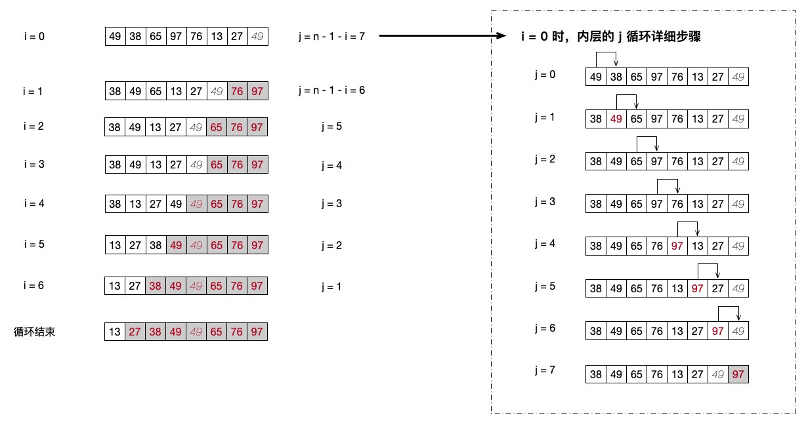
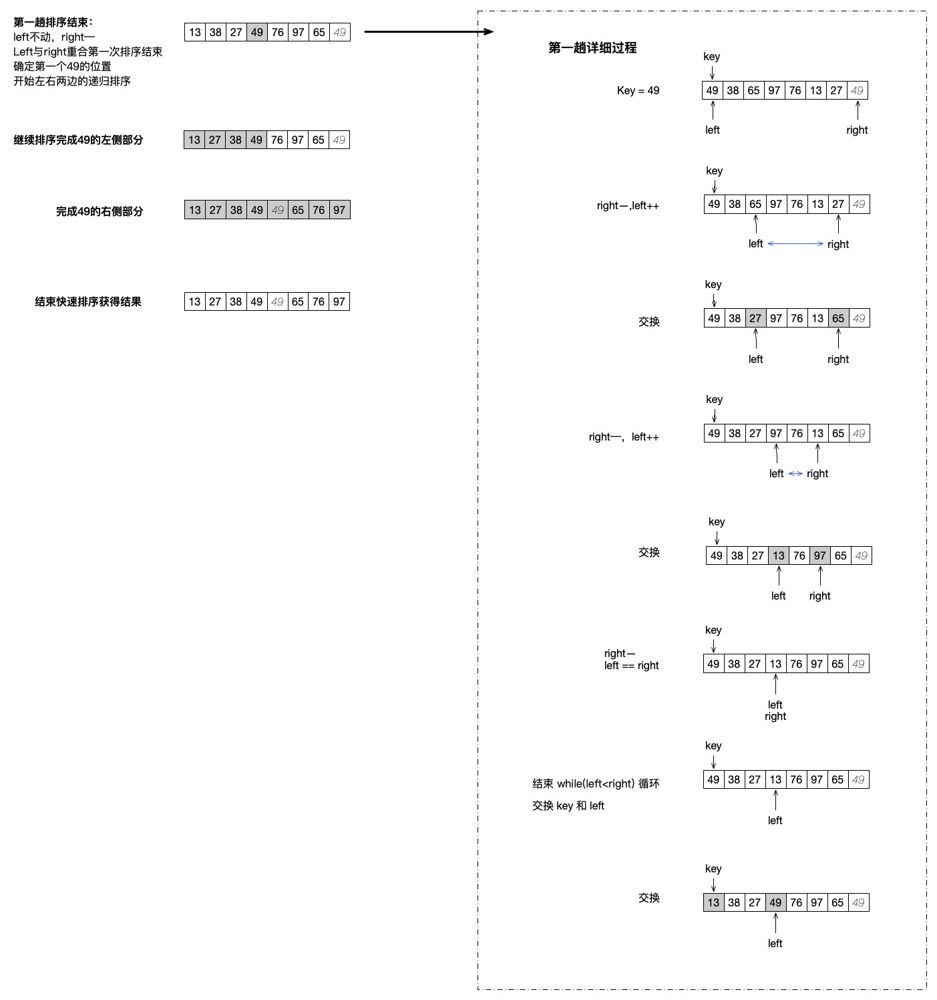

# 交换排序：冒泡、快排

上篇文章中我们好好地学习了一下插入类相关的两个排序，不过，和交换类的排序对比的话，它们真的只是弟弟。甚至可以说，在所有的排序算法中，最出名的两个排序都在今天要介绍的交换排序中了。不管是冒泡、还是快排，都是面试中的常见排序算法，常见到什么地步呢？但凡学习数据结构和算法，甚至是你完全没有学习过，也多少都会听说过这两个排序算法。而一些大中型公司更是直接在面试题中指明不要使用这两种算法来实现一些排序的题目，这又是为什么呢？那当然也是因为这两个算法实在是太出名了，很多人都随便就能手写出来。

当然，不管你面试的公司有什么要求，只要是有志在编程开发这个行业里发展的同学，冒泡和快排肯定会是面试中绕不开的一个坎。我们今天就来好好地学习一下这两个排序算法。不过首先还是要搞明白这个“交换”指的是什么意思。

上篇文章中的插入排序，指的是直接将数据插入到指定的位置。而交换的意思，则是让两个位置的数据在进行比对后直接交换。比如我们有 [3, 1, 2] 这样一个数组，需要排列成 [1, 2, 3] 这种形式。那么我们就可以先让 3 和 1比较，发现 1 小，于是将 3 和 1 的位置进行交换，结果是 [1, 3, 2] 。然后再让 3 和 2 比较，发现 2 小，再交换它们的位置，于是得到结果为 [1, 2, 3] 的数组。

当然，这个示例只是简单地说明了一下交换排序的原理。但万变不离其宗，不管是冒泡还是快排，它们的基本原理和核心思想都是这样的，让两个数据对比后根据规则交换位置。这里其实从代码中我们能够从一个地方很快地分辨出一段排序代码是否是交换排序，那就是他们会有一个对于两个元素进行数据交换的过程，而且往往在普通情况下会使用一个中间变量。这个我们一会看代码就可以看到。

## 冒泡排序

冒泡排序，先从名字来理解一下，它的意思其实是让数据像汽水中的泡泡一样一个一个的浮上来。

直接上代码了来看看，代码其实非常简单。

```php
function BubbleSort($numbers)
{
    $n = count($numbers);

    for ($i = 0; $i < $n - 1; $i++) { // 外层循环 n - 1
        for ($j = 0; $j < $n - $i - 1; $j++) { // 内层循环 n - 1 - i
            if ($numbers[$j] > $numbers[$j + 1]) { // 两两相比来交换
                $temp = $numbers[$j + 1];
                $numbers[$j + 1] = $numbers[$j];
                $numbers[$j] = $temp;
            }
        }
    }

    print_r($numbers);
}

BubbleSort($numbers);
// Array
// (
//     [0] => 13
//     [1] => 27
//     [2] => 38
//     [3] => 49
//     [4] => 49
//     [5] => 65
//     [6] => 76
//     [7] => 97
// )
```

光看代码自己推演的话其实还是不太好理解，那么我们就还是使出终极杀器，也就是图解步骤来看一下吧！



在代码中可以看到，我们有两层循环。所以这个图片中我们也是展示了 i 和 j 的两层循环情况。当然，限于篇幅，我们只展示了第一次 i 循环内部的 j 循环情况，也就是 i = 0 时，里面的 j 循环执行的情况。

- i = 0 是，内部的 j < n - 1 - i ，也就是内部的 j 要循环七次。我们直接就看右边的 j 循环的步骤。

- 冒泡排序其实就是利用 j 和 j + 1 来对比两个相信的元素。从图中我们就可以看出，每一次 j++ 都是在对当前 j 和下一个 j + 1 的元素进行比较。如果当前的这个 j 大于 j + 1 的话，就把它们交换位置。

- 当 j = 0 时，第 0 个位置的 49 是大于第 1 个位置的 38 的，于是 49 和 38 交换了位置。

- 当 j = 1 时，位置 1 的 49 和位置 2 的 65 相比，没有达成条件，于是不会变动。同理，j = 2 时也是对比的 65 和 97 ，同样不会发生交换。

- 当 j = 3 时，97 比 76 要大，于是发生了交换，97 交换到 j + 1 也就是下标 4 的位置。同时，97 也是整个序列中最大的数，于是后面会一直交换到这次的 j 循环结束。

- 最终的结果是 97 这个最大的数移动到了数据的最后一位。也就是说，最大的数已经放到了整个序列中的正确的位置上了。

- 接着内层循环结束，i++ ，开始第二次 i = 1 的内部 j 循环。这里需要注意的是，为什么我们要用 j < n - 1 - i 呢？因为我们前面已经完成了一个最大数的排序，就是将 97 这个最大数放到了最后的位置上。所以在 i++ 的第二次循环时，我们就要将第二大的数放在倒数第二的位置上。这时的 j 也不需要循环到最后一位了，只需要循环到倒数第二位就可以了。

从上面的分步讲解中，我们可以看到，外层的 i 每一次的循环其实就是通过内层的 j 循环来将一个最大的数按顺序放到后面的位置上。就像汽水不断地向上冒泡一样，它就是传说中的冒泡排序算法概念的由来。

其实关于冒泡排序的算法，还有一个口决是很多同学都知道的，也可以帮助我们记忆。

- 外层循环 N 减一

- 内层循环 N 减一减 I

- 两两相比小靠前（正序）

为什么小的靠前是正序呢？在代码中，我们 if 条件判断是的 j > j+1 ，如果成立就交换它们，也就是让大的数据放到了后面，小的数据放到了前面，这样一轮过后，最大的数据放在了最后一位，也就是完成了一个最大数据的位置的确定。如果我们将条件反过来，也就是 j < j+1 的话，就会让最大的数据放到最前面，也就是实现了倒序。是不是很神奇？小伙伴们可以试试哦，就改变一下 if 条件的大于号就可以了哦。

冒泡的时间复杂度其实很明显地就能看出来，O(N<sup>2</sup>)。属于效率一般但非常好理解的一种算法，而且它是一个稳定的排序算法。

## 快速排序

冒泡的感觉咋样？不过冒泡有个问题，那就是它只能对相邻的两个数据进行比较，所以 O(N<sup>2</sup>) 这个时间复杂度基本也就不包含什么最好最坏的情况了，不管怎么它都得要达到这个 O(N<sup>2</sup>) 的水平。

那么有没有什么别的方法能够对冒泡进行优化呢？当然有大佬就发明出了优化冒泡的一种排序算法啦。那就是快速排序算法。还记得在学习查找的时候我们学习过的二分查找吗？相对于线性查找来说，二分查找的效率是不是提升了很多。但快速排序的效率提升可达不到那么高，毕竟排序还是比查找要复杂些。而且它是在冒泡的基础上进行的改良，同样也使用了二分的思想，也就是分而治之的一种理念。让每次的比较不再只是两个相邻的元素一个一个地比较。所以它的平均时间复杂度可以提升到 O(NlogN) 的级别。相对于 O(N<sup>2</sup>) 来说，这个时间复杂度其实也有了不小的飞跃哦。特别是数据量越大的情况下越明显。

同样我们先来看看代码，然后再来看图分析这个算法。

```php
function QSort(&$arr, $start, $end)
{
    if ($start > $end) {
        return;
    }
    $key = $arr[$start];
    $left = $start;
    $right = $end;
    
    while ($left < $right) {
        // 右边下标确定
        while ($left < $right && $arr[$right] >= $key) {
            $right--;
        }
        // 左边下标确定
        while ($left < $right && $arr[$left] <= $key) {
            $left++;
        }
        if ($left < $right) { // 交换步骤
            $tmp = $arr[$left];
            $arr[$left] = $arr[$right];
            $arr[$right] = $tmp;
        }
    }

    $arr[$start] = $arr[$left];
    $arr[$left] = $key;
    // 递归左右两边继续
    QSort($arr, $start, $right - 1);
    QSort($arr, $right + 1, $end);
}

function QuickSort($numbers)
{
    QSort($numbers, 0, count($numbers) - 1);
    print_r($numbers);
}

QuickSort($numbers);
// Array
// (
//     [0] => 13
//     [1] => 27
//     [2] => 38
//     [3] => 49
//     [4] => 49
//     [5] => 65
//     [6] => 76
//     [7] => 97
// )
```

有没有发现熟悉的身影？没错，快速排序使用到了递归。这个递归其实也包含着分治的思想，就像秦国统一六国一样，分而治之。我们将某一个数据放到指定的位置之后再按左右分治的方式来继续其它的数据的排序，而不用让其它的数据再对整个序列进行完整的判断，从而提高排序的效率。因此，快排的时间复杂度相对冒泡来说就好了很多。



同样地，它表面上是不停地递归，其实递归也是一种循环，我们就可以看出来，它和冒泡一样其实是有着两层循环的概念的。这里我们也是以第一次的外层循环为例子来剖析它的内层循环都做了什么。

- 首先，我们确定了一个关键字 key ，这里我们就直接指定第一个数据 49 。然后指定左右两个指针，左指针 left 从 0 开始，右指针 right 从最右边的下标开始。

- 进入内层循环，条件是 left < right ，也就是左右两个指针不能相遇！

- 开始指针移动，先从右边开始，如果 right 指向的数据大于等于 key ，right 就进行减减操作，否则，指针就停住。可以看到，我们的指针停在了 27 这个数据的位置，也就是倒数第二个数据这里，第一个数据 49 和我们的 key 值 49 是一样的，于是 right 就移动到倒数第二个数据了，27 是小于 key 值的。

- 然后移动 left 指针，移动到符合条件的位置也就是值为 65 的这个下标，然后交换 left 和 right 的值。

- 继续后续的操作，直到 left 和 right 相遇了，这时退出循环，并在循环外面再次交换 key 和 left 位置的值。这时，第一个下标的 49 这个值就已经放到了它所确定的位置。也就是说，这个值完成了排序。

- 接着，以这个完成排序的值为中心，切分左右两个序列，继续进入递归排序的过程，直到所有数据完成排序。

看出快速排序和冒泡排序的区别了吧？快排的每趟排序都会确定一个关键字的具体位置，它的比较除了第一次是每个数都和 key 两两比较之外，其它都是采用分治的思想来缩小 n 的大小进行小范围的排序的。而且每次的循环都会将数据按针对 key 值的大小进行左右排列，这也是二叉搜索树的核心思想。这个内容我们的系列文章中没有讲解，大家可以自行查阅相关的资料学习。

## 小彩蛋：交换两个变量的值

今天学习的内容中都有一处核心的代码，就是最开始我们说过的交换两个变量值的代码。

```php
// 冒泡中
$temp = $numbers[$j + 1];
$numbers[$j + 1] = $numbers[$j];
$numbers[$j] = $temp;

// 快排中
$tmp = $arr[$left];
$arr[$left] = $arr[$right];
$arr[$right] = $tmp;
```

我们都使用到了一个临时变量来进行交换。不过不少的面试题中经常会看到一种题目就是不使用第三个变量，也就是这个临时变量来交换两个变量的值。大家有没有踫到过呢？其实有几种方案都可以，我们就来简单说两个。

```php
$a = 1;
$b = 2;
$a += $b; // a = 3
$b = $a - $b; // b = 3 - 2 = 1 
$a = $a - $b; // a = 3 - 1 = 2
echo $a, PHP_EOL; // 2
echo $b, PHP_EOL; // 1

$a = "a";
$b = "b";
$a .= $b; // a = "ab"
$b = str_replace($b, "", $a); // b = str_replace("b", "", "ab") = a
$a = str_replace($b, "", $a);// a = str_replace("a", "", "ab") = b
echo $a, PHP_EOL; // b
echo $b, PHP_EOL; // a
```

对于数字来说，直接使用第一段的加减操作就可以完成两个变量的交换。而对于字符串来说，就可以使用 str_replace() 来实现。其实它们的思想都是一样的，先合并到一个变量上，然后利用减法或者替换来让某一个变量先变成另一个变量的值。然后再使用相同的方法将另一个变量的值也转换成功。当然，这只是最简单最基础的一种算法，利用 PHP 的一些函数和特性，我们还可以更方便地实现这种功能。

```php
$a = 1;
$b = 2;
list($a, $b) = [$b, $a];
echo $a, PHP_EOL; // 2
echo $b, PHP_EOL; // 1
```

list() 函数是将一个数组中的数据分别存入到指定的变量中，而在 PHP 中我们也可以直接 [x, x] 这样来定义数组。所以不使用第三个临时变量来交换两个变量的功能我们只用这一行代码就搞定了。 list($a, $b) = [$b, $a] 。这里不点赞可真对不起这道题咯！！

## 总结

交换排序的这两种算法相当于数据结构与算法这门课程的门面担当，但凡要讲算法中的排序的，必然会有它们两个的身影。毕竟太经典了，不过我们可是先学了两个插入类的排序进行过了热身才来学习这两个经典算法的，相信大家进行对比之后就能更深入地理解这些算法的神奇和不同。

测试代码：

参考文档：

本文示例选自 《数据结构》第二版，严蔚敏

《数据结构》第二版，陈越